# 5 TPSI - Appunti
- [Richiami pila ISO/ISO TCP/IP](#background,-livellotrasporto-e-socket)
- [Progettazione protocollo](progettazione-di-un-protocollo)

# Background, livello trasporto e socket
Libro di testo - unità 1 Lezione 5 pg. 44-52.

Libro di testo - Unità 2 - Il socket e la comunicazione con i protocolli TCP/UDP

* 2.1 I socket e i protocolli per la comunicazione di rete pp.106-112
    * Generalità
    * Le porte di comunicazione e i socket
* 2.2 La connessione tramite socket pp.113-143
    * Generalità
    * Famiglie e tipi di socket
    * Trasmissione unicast e multicast
    * Lab 1 Java socket
    * Lab 2 Java socket: realizzazione di un server TCP
    * Lab 3 Realizzazione di un server multiplo in Java
    * Lab 4 Java socket: un’animazione client-server

[Video Pearson Tanenbaum](https://media.pearsoncmg.com/ph/streaming/esm/tanenbaum5e_videonotes/tanenbaum_videoNotes.html)
[Guida GaPiL - guida programmazione linux](http://gapil.gnulinux.it/)
[Guida stile java programming](https://math.hws.edu/eck/cs124/f21/style_guide.html)
https://people.na.infn.it/~garufi/didattica/CorsoAcq/Trasp/Lezione9/tcpip_ill/

## Pila TCP/IP e ISO/OSI richiami

Un protocollo è l’insieme di regole utilizzate da due entità per scambiarsi informazioni, specificando cosa deve essere comunicato, in che modo e quando.
Degli esempi di protocolli sono quelli utilizzati nell’architettura di rete a strati TCP/IP (ISO/OSI).

**CLIL Maffucci**
1. What is a protocol? [What is a protocol?](https://youtu.be/fK7oAc_V-Kk)
2. Why is so important that protocols are written? [What is a protocol?](https://youtu.be/fK7oAc_V-Kk)
3. Which are the two things that a protocol has to do? [What is a protocol?](https://youtu.be/fK7oAc_V-Kk)
4. Why are protocols so highly structured? [Why are protocols so highly structured?](https://youtu.be/1M1FqYrapCM)
5. What are clients and servers and which is the difference between them? [What is a client? What is a server?](https://youtu.be/xah8viUhW9Y)
6. What is the robustness principle? [What is the robustness principle?](https://youtu.be/_KrCQPR2I4s)
7. Regarding Internet protocol stack, explain what the two goals “Separation of concern” and “Reuse of good ideas” are. [What is the internet protocol stack?](https://youtu.be/yi41W6d1sRQ)
8. How can UDP be used other then its normal purpose? [Can you still deploy new transport protocols?](https://youtu.be/u2g1OLWT06M)
9. What is a peer-to-peer infrastructure? [What is a peer to peer system?](https://youtu.be/w2u4eN_WWvc)

Affinché due protocolli remoti di pari livello possano comunicare devono necessariamente usare i servizi offerti dal livello inferiore. Nella pila protocollare TCP/IP la comunicazione tra il livello applicativo e il livello di trasporto avviene attraverso una interfaccia che usa i socket e le API offerte dal sistema operativo per la programmazione. Il socket permette di identificare univocamente il processo all’interno di un’entità remota.

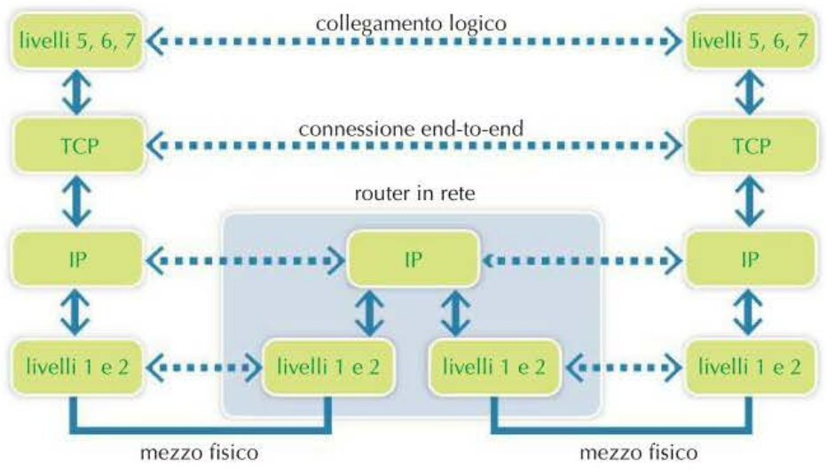

I dati inviati dal livello applicativo saranno incapsulati dai diversi livelli protocollari per aggiungere negli header tutti i dati necessari per permettere la comunicazione tra i protocolli di pari livello. Una volta giunto a destinazione avverrà la fase di decapsulamento per passare il payload al livello superiore.

 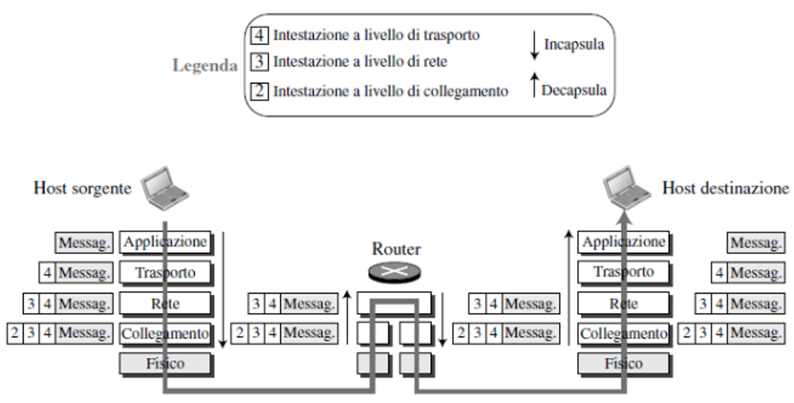 -

I pacchetti ( o messaggi) ad ogni livello vengono chiamati in modo diverso:

* Livello fisico: segnali ottici, elettrici, radio
* Livello collegamento: frame
* Livello rete IP: datagrammi o pacchetti
* Livello trasporto: segmenti TCP datagrammi per UDP
* Livello Applicazione: genericamente PDU (Protocolo Data Unit)

### Le porte e i socket
Video interessanti:
[Maffucci - inglese CLIL transport layer pearson you tube](https://www.youtube.com/watch?v=hi9BVTNvl4c)
	[link originale pearson](https://mediaplayer.pearsoncmg.com/_ph_cc_ecs_set.title.1-6_Protocols_and_Layers__/ph/streaming/esm/tanenbaum5e_videonotes/1_6_protocol_layers_cn5e.m4v)
[Maffucci - inglese CLIL Socket pearson](https://www.youtube.com/watch?v=WyrxZB7Mbs4)

[Wikipedia Berkeley sockets](https://en.wikipedia.org/wiki/Berkeley_sockets)
Ogni livello aggiunge nel proprio header le informazioni necessarie per svolgere il proprio compito o servizio. Per esempio, il livello IP ha il compito di effettuare il routing dei datagrammi. Una volta che un datagramma è arrivato a destinazione, il suo compito è finito e  l'header non contiene nessuna informazione per individuare il processo a cui è stato inviato il pacchetto. Il protocollo IP non consente di distinguere più destinazioni di datagrammi all’interno della stessa macchina, poiché considera solo il singolo indirizzo IP della macchina. Di per sé, questo imporrebbe una limitazione molto pesante: per ogni macchina, potrebbe comunicare sulla rete una sola applicazione alla volta. Questo limite si è risolto a livello di trasporto.

 A livello di trasporto, viene garantito un canale di comunicazione **logico** end to end tra due host che si devono parlare (e i due host non sono connessi direttamente come avviene a livello IP tra due router che si scambiano un pacchetto). Questo canale è garantito con il concetto di porta e  con la coppia _<indirizzo ip, numero di porta>_ che definisce un socket. I socket forniscono un'**astrazione** per stabilire connessioni di rete e trasmettere dati utilizzando vari protocolli come TCP o UDP.
 
 Un socket è identificato da una coppia unica di indirizzo IP e numero di porta. L'indirizzo IP identifica il dispositivo nella rete, mentre la porta identifica il processo o l'applicazione specifica sul dispositivo. Il numero di porta è un concetto introdotto nel livello di trasporto proprio per permettere la distinzione di "processi destinari diversi" su una stessa macchina, quindi processi che hanno lo stesso indirizzo ip. Un socket definisce quindi un canale di comunicazione tra due processi risiedenti su macchine diverse. Il numero di porta permette di definire il punto di accesso associati ad un processo all'interno di una macchina. Le porta sono identificate da un numero intero positivo codificato in 16 bit (assegnati da IANA a livello internazionale):
 
* Well Known Ports (da 0 a 1.023)
* Registered Ports (da 1.024 a 49.151)
* Private Ports (da 49.152 a 65.535)

Le porte sono un concetto cruciale nei socket e nelle comunicazioni di rete per diverse ragioni:

* Multiplex: Permettono a un singolo dispositivo di gestire multiple connessioni simultanee. Senza le porte, un computer potrebbe comunicare con un solo altro dispositivo alla volta.
* Identificazione del servizio: Le porte identificano specifiche applicazioni o servizi su un dispositivo. Ad esempio, il web server tipicamente usa la porta 80, mentre l'email usa la 25.
* Routing delle connessioni: Aiutano il sistema operativo a instradare i dati in arrivo all'applicazione corretta.
* Sicurezza: Permettono di controllare l'accesso a specifici servizi attraverso il firewall.

Per progettare un protocollo applicativo (stiamo quindi usando i servizi messi a disposizione dal livello di trasporto e creando un servizio a livello Applicazione (livelli 5,6 e 7 ISO/ISO; ultimo livello TCP/IP) è necessario conoscere le differenze che ci sono tra i due protocolli a livello di trasporto: UDP e TCP. 
I socket a livello TCP vengono chiamati  **Socket Stream** (perché TCP trasmette flussi di byte) mentre per UDP i socket sono chiamati **Socket Datagram** (perché UDP trasmette pacchetti di taglia fissa detti datagram UDP)

### Multiplexing/Demultiplexing
Immagina che il tuo computer sia un grande edificio con tantissime stanze. Ogni stanza è un'applicazione diversa: c'è la stanza dei giochi, la stanza della musica, la stanza dei compiti, e così via.

Ora, le porte sono come le porte d'ingresso di queste stanze. Ogni porta ha un numero, proprio come le stanze di un hotel.

Quando arriva un messaggio da Internet (immagina sia una lettera), deve sapere in quale stanza entrare. Ecco come funziona:

1. Multiplexing (invio di messaggi): Quando il tuo computer vuole inviare messaggi a Internet, è come se stesse inviando lettere. Ogni lettera esce dalla porta giusta: la lettera del gioco esce dalla porta dei giochi, la lettera della musica dalla porta della musica, e così via. In questo modo, tante applicazioni possono inviare messaggi contemporaneamente.
2. Demultiplexing (ricezione di messaggi): Quando arrivano messaggi da Internet, è come se arrivassero tante lettere. Il tuo computer guarda il numero sulla busta (il numero di porta) e sa esattamente in quale stanza (applicazione) deve consegnare ogni lettera.

I protocolli del livello di trasporto mettono in comunicazioni le applicazioni (in realtà è meglio dire i processi, quindi un'applicazione, formata da più processi, può avere al suo attivo più di una connessione logica <indirizzo ip, porta>) attraverso un servizio chiamato Multiplexing/Demultiplexing.

Le socket permettono proprio di realizzare questo servizio.i programmi applicativi utilizzano i protocolli mediante apposite in- terfacce (API) fornite dal sistema operativo e dal software di rete. In generale, queste API non sono standardizzate, ma, fortunatamente, per i protocolli TCP e UDP, esi- ste uno standard de facto (disponibile nella stragrande maggioranza dei linguaggi di programmazione, tra cui, ad esempio, C e Java): l’interfaccia socket.

I socket sono stati inizialmente definiti nel 1983, e da allora si sono affermati come lo standard de facto per l’implementazione di applicazioni distribuite.

**Interoperabilità**
I socket sono disponibili su moltissime piattaforme (sistemi operativi e linguaggi di pro- grammazione). Grazie a essi, si ottiene quindi l’interoperabilità dei programmi di rete: due applicazioni che usano i socket (con lo stesso protocollo di trasporto, ad esempio TCP) possono interagire anche se vengono eseguite su macchine con sistemi operativi diversi, e/o se sono scritte in linguaggi di programmazione diversi.

Viceversa, applicazioni che utilizzano protocolli (di trasporto, applicativi, ecc.) diversi non possono interagire. Ad esempio, un’applicazione che utilizza UDP non può interagire con un’applicazione che utilizza TCP. Infatti, un elemento fondamentale della nozione di protocollo è che le applicazioni comunicanti usino appunto lo stesso protocollo.

Letteralmente, il termine inglese socket significa “presa”. Infatti, un socket rappresenta uno dei “terminali” di un collegamento tra due macchine.
Per una determinata connessione, c’è un socket su ogni macchina, e si può immaginare un ipotetico “cavo” avente le due estremità collegate a questi socket, attraverso il quale avviene la comunicazione, e che persiste finché non viene esplicitamente disconnesso.

I socket usati normalmente, come lo stream socket (TCP) o il datagram socket (UDP), ricevono i dati dal livello di trasporto privati degli header dei livelli sottostanti, quindi ricevono solo il payload costituito dai dati finali. Questo vuol dire che non sarà fornita direttamente alcuna informazione relativamente all’indirizzo MAC e IP del sorgente; se la comunicazione avviene tra macchine diverse, viene effettuato solo uno scambio di dati.

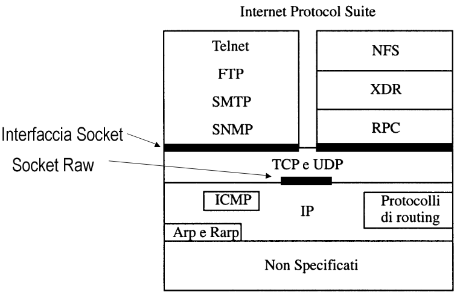

Un raw socket permette all’applicazione ricevente di accedere direttamente ai protocolli di basso livello, permettendo quindi di ricevere un pacchetto non decapsulato, con tutti gli header dei diversi livelli protocollari; infatti per un raw socket non serve fornire l’indirizzo MAC e IP. 

Identificazione di una connessione logica a livello di trasporto:

Una connessione logica a livello di trasporto è identificata da 5 elementi chiave:

1. Protocollo (es. TCP o UDP)
2. Indirizzo IP sorgente
3. Porta sorgente
4. Indirizzo IP destinazione
5. Porta destinazione

Questa quintupla _<protocollo, IP_sorgente, porta_sorgente, IP_destinazione, porta_destinazione>_ definisce univocamente una connessione.

Elementi simmetrici della comunicazione:

* Mittente: identificato da \<IP\_sorgente, porta\_sorgente>
* Destinatario: identificato da \<IP\_destinazione, porta\_destinazione>

Socket:

* Ogni coppia \<indirizzo\_IP, porta> definisce un socket
* La connessione logica tra processi è stabilita tra due socket:
    * Socket mittente
    * Socket destinatario

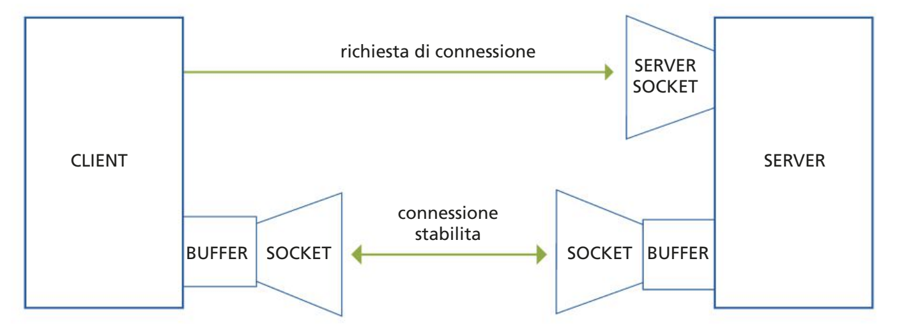

Una connessione logica a livello di trasporto è completamente definita dalla quintupla sopra menzionata, che a sua volta identifica i due socket coinvolti nella comunicazione. Questa struttura permette di gestire multiple connessioni simultanee, distinguendo univocamente ciascuna comunicazione in corso sulla rete.

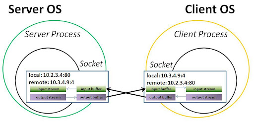
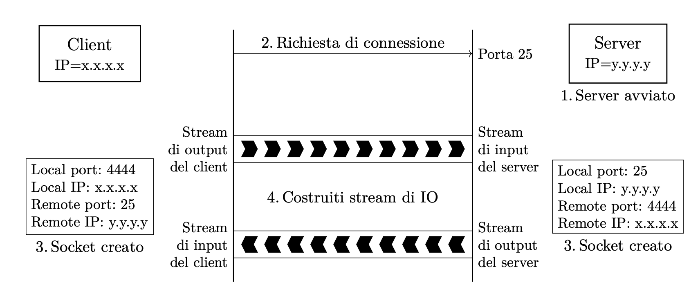

1. Su una macchina con indirizzo IP y.y.y.y viene avviato il server, che si mette in ascolto, ad esempio, sulla porta 25.

2. Il client, eseguito su una macchina con indirizzo x.x.x.x, invia una richiesta di connessione al server (cioè all’indirizzo y.y.y.y e alla porta 25).

3. Quando il server accetta la connessione, si creano (contemporaneamente) i socket a lato client e a lato server.

4. Client e server costruiscono degli stream di input e di output sopra ai rispettivi soc- ket. L’input stream del server corrisponde all’output stream del client, e viceversa. Utilizzando questi stream, client e server possono comunicare “quanto vogliono”, secondo le regole del protocollo applicativo.

Infine, al termine della comunicazione, la connessione verrà chiusa, e i socket verranno distrutti.

### Protocolli di trasporto: UDP e TCP

Video interessanti: 
[Maffucci - inglese CLIL tcp vs UDP]( https://www.youtube.com/watch?v=Vdc8TCESI)
[Manfrin TCP vs UDP](https://www.youtube.com/watch?v=PtcRCbi0mUI)

[Articolo Freecode Camp](https://www.freecodecamp.org/news/tcp-vs-udp/)

#### UDP

UDP vede ogni pacchetto come un singolo messaggio da inviare, per questo si dice _message-oriented_.

- pacchetti piccole dimensioni (60% più piccoli, UDP header 8 bytes TCP header 2- bytes)
- senza connessione (**connectionless**)
- maggiore controllo sui dati inviati
- forma primitiva di errore detection (checksum), no error recovery (se un datagram è corrotto o viene semplicemente scartato oppure consegnato con un warning a livello applicativo) (il checksum non è obbligatorio in ipv4, è obbligatorio in ipv6)
- nessuna forma di ritrasmissione per i pacchetti persi. Ogni pacchetto viene inviato una volta sola. Se i pacchetti vengono persi, vengono persi.
- i pacchetti non arrivano nell'ordine in cui sono stati inviati
- nessun controllo congestione del traffico (in caso di congestione di una rete, i pacchetti vengono scartati più spesso)
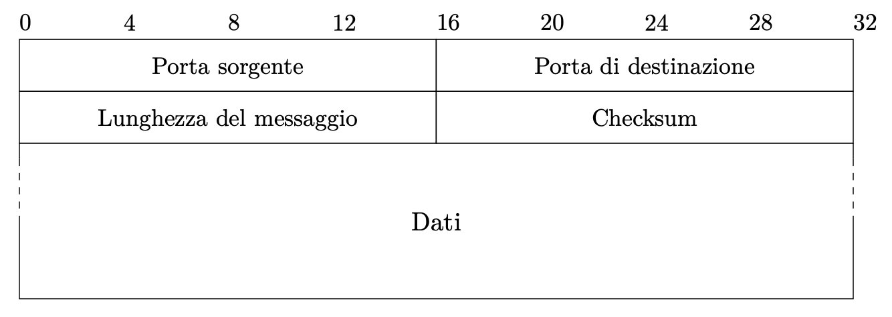

Oltre ai numeri di porta (che sono di 16 bit ciascuno, quindi permettono di distingue- re fino a 216 applicazioni all’interno di una macchina), l’header UDP contiene solo le seguenti informazioni di servizio:

• lunghezza del messaggio (16 bit), misurata in byte;\
• checksum (16 bit), per il rilevamento di errori nella trasmissione (facoltativa: se

non usata, questo campo contiene il valore 0).

Non è invece presente l’indirizzo IP, dato che esso è già presente nell’header del datagramma IP, all’interno del quale i pacchetti UDP vengono incapsulati per essere trasmessi:

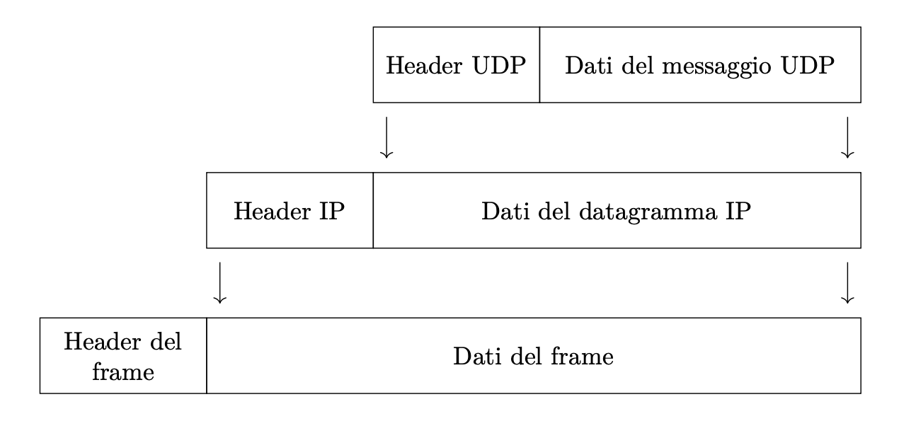
Casi d'uso ideali:

* Applicazioni in tempo reale (es. VoIP, streaming video)
* Trasmissioni brevi e veloci
* Scenari dove la perdita occasionale di dati è accettabile

Esempi di utilizzo di UDP:

1. Streaming video in diretta:

   * Piattaforme come Twitch o YouTube Live utilizzano UDP per trasmettere video in tempo reale.
   * La perdita occasionale di pacchetti può causare brevi glitch, ma non interrompe lo stream.

2. Videogiochi online:

   * Giochi sparatutto in prima persona come "Call of Duty" o "Fortnite" usano UDP per aggiornamenti rapidi della posizione dei giocatori.
   * La bassa latenza è cruciale per un'esperienza di gioco fluida.

3. VoIP (Voice over IP):

   * Applicazioni come Skype o Discord utilizzano UDP per le chiamate vocali.
   * Piccole perdite di pacchetti sono preferibili a ritardi nella conversazione.

4. DNS (Domain Name System):

   * Le query DNS utilizzano UDP per una risoluzione rapida dei nomi di dominio.
   * Se una query fallisce, può essere facilmente ripetuta.

5. SNMP (Simple Network Management Protocol):
   * Usato per il monitoraggio di dispositivi di rete, dove la velocità è più importante della garanzia di consegna.

#### TCP

TCP vede ogni pacchetto come parte di un unico grande flusso di pacchetti, per questo si dice _stream_oriented_.
Questo protocollo è più affidabile di UDP a scapito di un maggiore overhead di gestione.

- 3 way handshake per stabilire una connessione (e poi per chiuderla 2 way)
- stabilita una connessione, è possibile monitorare la ricezione dei pacchetti e il destinatario può confermare di aver ricevuto un pacchetto
- controllo errori (checksum obbligatorio)
- ritrasmissione dei pacchetti non confermati (sistema di acknowledgment basato su campo ACK)
- i segmenti sono numerati. Anche se i pacchetti arrivano a destinazione in un ordine diverso, il livello di trasporto del destinario li riordina prima di consegnarli al livello superiore.
- implementa un controllo della congestione e rallenta la trasmissione dei pacchetti in caso di congestione della rete.

Svantaggi:

- header maggiore dimensione
- controllo congestione: rallentamento nella comunicazione. (Per esempio Voip application real time application, latenza diventa fastidiosa)
- maggiore overhead per ristrasmissione pacchetti, conferma ricezione pacchetti

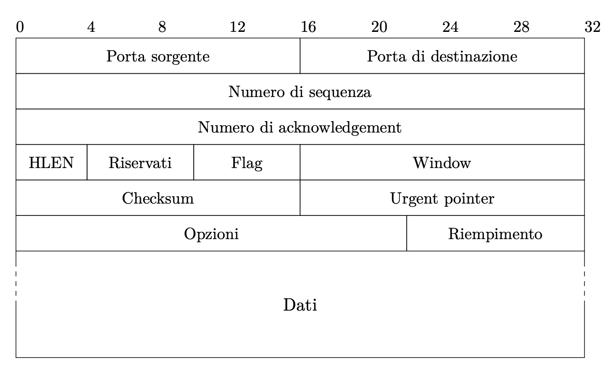

**PAR: Positive Acknowledgement with Retransmission**
Quando il destinatario riceve un messaggio, invia al mittente una conferma di ricezione (acknowledgement, ACK). Se il mittente non ottiene tale riscontro entro un certo tempo (time-out), deduce che il pacchetto sia andato perso, e lo ritrasmette. Questo procedimento si ripete finché non è confermata la ricezione del pacchetto da parte del destinatario.
Ogni riscontro indica anche il numero di byte che il ricevente è in grado di accettare. Esso serve al controllo di flusso (meccanismo sliding window): il ricevente può segnalare al trasmittente se si ha congestione sulla linea, e addirittura annullare la trasmissione di altri pacchetti, indicando di essere disposto a ricevere 0 byte. Senza un meccanismo del genere, se un pacchetto arrivasse in ritardo a causa della congestione, il mittente potrebbe pensare che esso si sia perso, e quindi ritrasmetterlo, ma ciò aumenterebbe ulteriormente la congestione sulla rete, in un circolo vizioso.

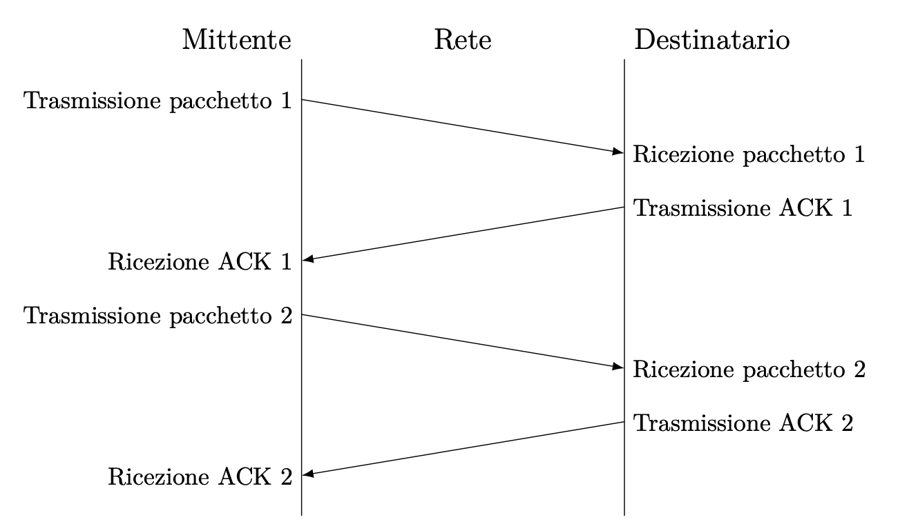
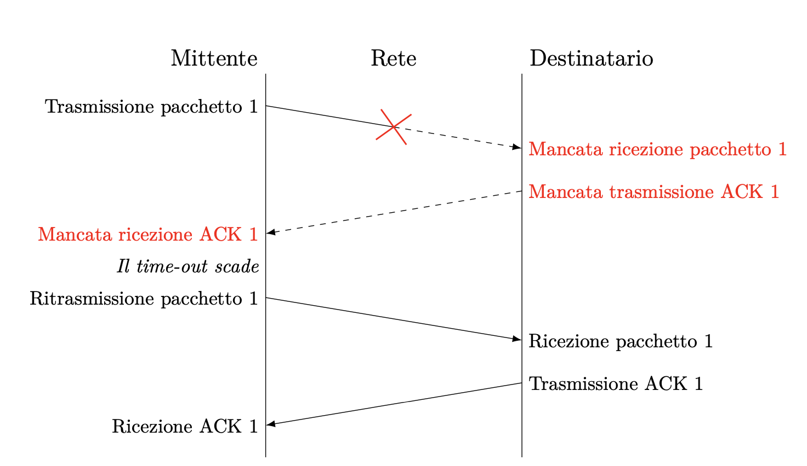

Casi d'uso ideali:

* Trasferimento file
* Email
* Web browsing
* Applicazioni che richiedono consegna affidabile e ordinata dei dati

Esempi di utilizzo di TCP:

1. Navigazione web:

   * I browser web utilizzano TCP per caricare pagine HTML, CSS e JavaScript.
   * Garantisce che tutti i componenti di una pagina siano ricevuti correttamente e nell'ordine giusto.

2. Email:
   * Protocolli come SMTP, POP3 e IMAP utilizzano TCP per garantire la consegna affidabile dei messaggi.

3. File Transfer:
   * Protocolli come FTP e SFTP usano TCP per assicurare che i file siano trasferiti senza errori o perdite di dati.

4. Database remoti:
   * Le connessioni a database come MySQL o PostgreSQL utilizzano TCP per garantire l'integrità delle transazioni.

5. Messaggistica istantanea:
   * App come WhatsApp o Facebook Messenger usano TCP per assicurare che i messaggi siano consegnati nell'ordine corretto e senza perdite.

6. Streaming video on-demand:
   * Servizi come Netflix utilizzano TCP per lo streaming di film e serie TV, dove la completezza del contenuto è più importante della latenza in tempo reale.

7. SSH (Secure Shell):
   * Utilizzato per l'accesso remoto sicuro a sistemi, dove l'integrità e l'ordine dei comandi sono critici.

8. E-commerce:
   * I siti di shopping online usano TCP per gestire transazioni, garantendo che i dettagli degli ordini e i pagamenti siano processati correttamente.

#### Elenco protocolli dei vari livelli

**IPv4 (Internet Protocol version 4)**  
È quello che comunemente si chiama IP. Ha origine negli anni ’80 e da allora è la base su cui è costruita internet. Usa indirizzi a 32 bit, e mantiene tutte le informazioni di instradamento e controllo per la trasmissione dei pacchetti sulla rete; tutti gli altri protocolli della suite (eccetto ARP e RARP, e quelli specifici di IPv6) vengono trasmessi attraverso di esso.

**IPv6 (Internet Protocol version 6)**  
È stato progettato a metà degli anni ’90 per rimpiazzare IPv4. Ha uno spazio di indirizzi ampliato 128 bit che consente più gerarchie di indirizzi, l’auto-configurazione, ed un nuovo tipo di indirizzi, gli anycast, che consentono di inviare un pacchetto ad una stazione su un certo gruppo. Effettua lo stesso servizio di trasmissione dei pacchetti di IPv4 di cui vuole essere un sostituto.

**TCP (Transmission Control Protocol)**  
È un protocollo orientato alla connessione che provvede un trasporto affidabile per un flusso di dati bidirezionale fra due stazioni remote. Il protocollo ha cura di tutti gli aspetti del trasporto, come l’acknowledgment, i timeout, la ritrasmissione, ecc. È usato dalla maggior parte delle applicazioni.

**UDP (User Datagram Protocol)**  
È un protocollo senza connessione, per l’invio di dati a pacchetti. Contrariamente al TCP il protocollo non è affidabile e non c’è garanzia che i pacchetti raggiungano la loro destinazione, si perdano, vengano duplicati, o abbiano un particolare ordine di arrivo.

**ICMP (Internet Control Message Protocol)**  
È il protocollo usato a livello 2 per gestire gli errori e trasportare le informazioni di controllo fra stazioni remote e instradatori (cioè fra host e router). I messaggi sono normalmente generati dal software del kernel che gestisce la comunicazione TCP/IP, anche se ICMP può venire usato direttamente da alcuni programmi come ping. A volte ci si riferisce ad esso come ICMPv4 per distinguerlo da ICMPv6.

**IGMP (Internet Group Management Protocol)**  
È un protocollo di livello 2 usato per il multicast. Permette alle stazioni remote di notificare ai router che supportano questa comunicazione a quale gruppo esse appartengono. Come ICMP viene implementato direttamente sopra IP.

**ARP (Address Resolution Protocol)**  
È il protocollo che mappa un indirizzo IP in un indirizzo hardware sulla rete locale. È usato in reti di tipo broadcast come Ethernet, Token Ring o FDDI che hanno associato un indirizzo fisico (il MAC address) alla interfaccia, ma non serve in connessioni punto-punto.

**RARP (Reverse Address Resolution Protocol)**  
È il protocollo che esegue l’operazione inversa rispetto ad ARP (da cui il nome) mappando un indirizzo hardware in un indirizzo IP. Viene usato a volte durante l’avvio per assegnare un indirizzo IP ad una macchina.

**ICMPv6 (Internet Control Message Protocol, version 6)**  
Combina per IPv6 le funzionalità di ICMPv4, IGMP e ARP.

**EGP (Exterior Gateway Protocol)**  
È un protocollo di routing usato per comunicare lo stato fra gateway vicini a livello di sistemi autonomi, con meccanismi che permettono di identificare i vicini, controllarne la raggiungibilità e scambiare informazioni sullo stato della rete. Viene implementato direttamente sopra IP.

**OSPF (Open Shortest Path First)**  
È un protocollo di routing per router su reti interne, che permette a questi ultimi di scambiarsi informazioni sullo stato delle connessioni e dei legami che ciascuno ha con gli altri. Viene implementato direttamente sopra IP.

**GRE (Generic Routing Encapsulation)**  
È un protocollo generico di incapsulamento che permette di incapsulare un qualunque altro protocollo all’interno di IP.

**PPP (Point-to-Point Protocol)**  
È un protocollo a livello 1 progettato per lo scambio di pacchetti su connessioni punto punto. Viene usato per configurare i collegamenti, definire i protocolli di rete usati ed incapsulare i pacchetti di dati. È un protocollo complesso con varie componenti.

**SLIP (Serial Line over IP)**  
È un protocollo di livello 1 che permette di trasmettere un pacchetto IP attraverso una linea seriale.

##### Protocolli sicurezza

**AH (Authentication Header)**  
Provvede l’autenticazione dell’integrità e dell’origine di un pacchetto. È una opzione nativa in IPv6 e viene implementato come protocollo a sé su IPv4. Fa parte della suite di IPSEC che provvede la trasmissione cifrata ed autenticata a livello IP.

**ESP (Encapsulating Security Payload)**  
Provvede la cifratura insieme all’autenticazione dell’integrità e dell’origine di un pacchetto. Come per AH è opzione nativa in IPv6 e viene implementato come protocollo a sé su IPv4.

**PSec (Internet Protocol Security)**

È una suite di protocolli che provvede la cifratura e l’autenticazione dei pacchetti IP a livello di rete. Include AH (Authentication Header) ed ESP (Encapsulating Security Payload) e viene utilizzato per creare connessioni sicure tra nodi sulla rete.

**SSL (Secure Sockets Layer)**

È un protocollo di sicurezza progettato per fornire comunicazioni sicure su una rete di computer. È stato originariamente sviluppato da Netscape per la trasmissione sicura dei dati tra web server e browser.

**TLS (Transport Layer Security)**

È il successore di SSL e fornisce privacy e integrità dei dati tra due applicazioni comunicanti. Viene utilizzato in molte applicazioni, come il web browsing, email, instant messaging e VoIP.

# Progettazione di un protocollo

**Note varie**
vedere appunti Maffucci e Elena
preparare un esercizio guidato su progettazione protocollo da mostrare insieme in classe
dare un esercizio da fare in classe

https://www.rfc-editor.org/rfc/rfc1350 → vedere compito 20221130-Progettazione protocolli

classe 5C Maffucci molti esempi progettazione

soluzione vari protocolli negli appunti: https://docs.google.com/document/d/1FBa2I5M1LQZBK13vEheP0XhBgJ2tokx666NaACDlSss/edit#heading=h.3tbugp1

Esame di stato 2018 - proporre esercitazione ai ragazzi - vedere appunti Maffucci

**fine note varie**

## Fasi progettazione di un protocollo

Quali sono gli aspetti da considerare quando progettiamo un nuovo protocollo applicativo?

Ogni protocollo deve definire le regole per gestire i seguenti aspetti (non necessariamente un protocollo deve gestirli tutti):

1. indirizzamento;
2. frammentazione e riassemblaggio
3. incapsulamento
4. controllo connessione
5. servizio confermato o non confermato;
6. controllo degli errori;
7. controllo del flusso;
8. multiplexing e demultiplexing;
9. servizi di trasmissione.

Per progettare di un nuovo protocollo applicativo si deve prima di tutto stabilire il tipo di servizio che è necessario usare al livello di trasporto, decidendo se il nuovo protocollo di comunicazione a livello applicativo dovrà appoggiarsi ad un servizio connection-oriented o connectionless; nel primo caso si userà TCP, nel secondo UDP.

Questa scelta dipende da molti fattori in quanto optare per un servizio orientato alla connessione permette di demandare al livello di trasporto tutto ciò che è relativo all’instaurazione di una connessione affidabile e, se non viene richiesta una ulteriore gestione di connessione, la progettazione del protocollo risulterà più semplice.

Si osservi che la scelta del servizio a livello di trasporto non determina le caratteristiche del nuovo protocollo di comunicazione a livello applicativo. Ad esempio, se si sceglie a livello di trasporto il protocollo TCP, non consegue che il nuovo protocollo sia necessariamente connection-oriented; il nuovo protocollo potrà essere orientato alla connessione o meno a seconda degli aspetti che saranno implementati. Usare un certo servizio a livello di trasporto determina solo i servizi che il nuovo protocollo userà.

Per esempio, se si decide di usare UDP per avere un minore overhead e avere un servizio di trasporto meno affidabile, ma il protocollo applicativo necessita di essere affidabile, sarà compito del protocollo applicativo gestire eventuali trasmissioni di pacchetti persi e ritrasmetterli.

### Indirizzamento
L’indirizzamento permette di identificare univocamente una entità nella rete. Esistono diversi livelli di indirizzamento e ogni livello ha una propria visibilità:

* l’indirizzo fisico, come ad esempio l’indirizzo MAC, ha una visibilità locale ad una rete;

* l’indirizzo di rete, come ad esempio l’indirizzo IP, ha una visibilità globale su più reti;

* l’indirizzo del processo, come ad esempio il numero di porta in TCP/IP o il Service Access Point in OSI, ha una visibilità locale al sistema.

Se il protocollo è di tipo client-server il nuovo protocollo di comunicazione dovrà indicare il numero di porta del server, mentre la scelta per il client sarà lasciata al Sistema Operativo.

Questo aspetto riguarda l’indirizzamento a livello di trasporto, a livello applicativo il protocollo che si andrà a progettare potrebbe richiedere una sua propria forma di indirizzamento per identificare la risorsa finale oggetto della comunicazione, come ad esempio il nome di un file.

### Frammentazione e riassemblaggio
Se il protocollo progettato per il livello applicativo lo prevede, i dati dovranno essere frammentati in blocchi più piccoli, se necessario di dimensione fissata, e ogni blocco sarà successivamente passato al livello di trasporto. Se nel nuovo protocollo viene prevista questa fase, vista la tecnica di commutazione usata in Internet, di tipo packet switching, sarà probabilmente opportuno determinare una modalità per numerare i frammenti, per consentire di riassemblarli nel giusto ordine una volta raggiunta la destinazione (il protocollo applicativo paritario).

La frammentazione e il riassemblaggio sono utili in quanto permettono di:

* effettuare il controllo degli errori su ogni blocco;

* utilizzare in modo equo il mezzo trasmissivo;

* ritrasmettere un solo blocco in caso di errori, invece dell’intero messaggio originale;

* subire minori ritardi;

* avere un buffering di dimensione ridotte,

ma al contempo prevedono anche alcuni svantaggi, tra cui:

* una maggiore elaborazione in quanto i frammenti devono essere riassemblati in ordine;

* una minore quantità di dati trasmessi nell'unità di tempo vista la maggiore elaborazione richiesta (minor throughput).

### Incapsulamento
L’incapsulamento definisce quali informazioni di controllo devono essere aggiunte ai dati e come vengono organizzate nel pacchetto, affinché due entità remote di pari livello possano gestire correttamente il payload.

L’incapsulamento prevede ad esempio l’aggiunta di:

* indirizzi;

* codici per il controllo degli errori;

* comandi di controllo per la gestione del dato;

* ecc.,

organizzandoli in un header ed eventualmente un tail.

### Controllo della connessione

La progettazione di un nuovo protocollo comunicativo a livello applicativo servirà al perseguimento di uno specifico scopo e, in base a questo si dovrà decidere se il nuovo protocollo dovrà essere orientato alla connessione o non orientato alla connessione, indipendentemente dal servizio scelto al livello di trasporto.

Se il nuovo protocollo è orientato alla connessione (connection-oriented) deve prevedere le seguenti fasi:

1. creazione della connessione;

2. trasmissione dei dati;

3. chiusura della connessione.

Se invece il protocollo non è orientato alla connessione (connectionless) queste fasi non sono previste.

Nella fase di creazione della connessione le entità si accordano su come scambiare i dati:

1. nel caso più semplice il mittente fa una richiesta di connessione e il ricevente la accetta o la rifiuta;

2. nel caso più complesso le due entità dovranno prevedere l’instaurazione di una connessione, oltre alla eventuale fase di negoziazione per garantire un determinato livello del servizio di trasmissione (priorità, qualità del servizio, sicurezza).

Qualunque sia la modalità scelta, la creazione di una connessione prevede il mantenimento dei dati della sessione di comunicazione e quindi le due parti dovranno riservare risorse per mantenere memorizzato l’identità dell’entità paritaria della comunicazione, identificata in qualche modo, oltre allo spazio di memoria dedicato al mantenimento dei dati della comunicazione.

Nella fase di trasferimento dei dati si dovranno prevedere tutti o solo parte dei seguenti controlli:

1. corretta sequenza dei blocchi di dati prevedendo, ad esempio, nello header un codice che permetta di ricostruire il dato originale, nel caso sia stato frammentato, indipendentemente dall’ordine di arrivo dei pacchetti;

2. controllo degli errori, ad esempio utilizzando un CRC ([Cyclic Redundancy Check](https://en.wikipedia.org/wiki/Cyclic_redundancy_check));

3. controllo del flusso, ad esempio prevedendo un limite massimo di pacchetti che possono essere trasmessi per motivi di bufferizzazione.

Nella fase di chiusura della connessione le due entità concordano in qualche modo di terminare la comunicazione e rilasciano tutte le risorse allocate durante la fase di apertura della connessione.

### Servizio affidabile
A seconda dello scopo per cui viene creato il nuovo protocollo, si può prevedere che esso sia affidabile progettando una tecnica di conferma dei pacchetto ricevuti, oppure può essere previsto che non sia affidabile evitando tale progettazione.

Le modalità di conferma possono essere molto semplici come la conferma di ogni singolo pacchetto appena questo viene ricevuto, oppure prevedere tecniche più raffinate come la conferma cumulativa simile a quella adottata dal protocollo TCP.

### Controllo degli errori
Se il protocollo che si sta progettando richiede la rilevazione degli errori, sarà necessario sviluppare o adottare una tecnica di controllo degli errori che permetta di individuare eventuali alterazioni dei dati e/o delle informazioni di controllo.

Le modalità adottabili possono essere le più varie, ad esempio si possono prevedere  due fasi dove il destinatario individua gli errori e quindi richiede esplicitamente la ritrasmissione del dato, oppure il destinatario rileva l’errore scartando il pacchetto e demandando al mittente la ritrasmissione del dato che eventualmente non risulta confermato, come avviene in TCP, avvalendosi dell’ausilio di timer appositi. 

Inoltre esistono diversi algoritmi che permettono di generare codici in grado solo di individuare l’errore, come i codici di parità, la check-sum o il CRC ([Cyclic Redundancy Check](https://en.wikipedia.org/wiki/Cyclic_redundancy_check)), o addirittura di correggerli, come i codici di parità trasversale e longitudinale  o il codice di Hamming. 

### Controllo del flusso
Il controllo del flusso è utilizzato dal ricevente per limitare o aumentare la velocità con cui la sorgente invia i dati; la sorgente non deve inviare più dati di quanti il ricevente ne possa processare, ma allo stesso tempo, se il ricevente fosse in grado di reggere la velocità di invio del mittente, sarebbe opportuno aumentare la velocità di spedizione.

La progettazione di un nuovo protocollo di comunicazione deve prevedere una modalità di controllo del flusso, in quanto da questa dipenderà anche la gestione delle risorse necessarie per la bufferizzazione dei dati ricevuti. Se questa gestione non viene progettata accuratamente si rischierà di perdere dei dati.

La modalità più semplice di gestione del flusso prevede che ad ogni invio di un dato il mittente debba attendere la conferma di ricezione da parte del destinatario. Chiaramente questa gestione è inefficiente, ma raggiunge perfettamente lo scopo in modo molto semplice.

Tecniche più avanzate possono prevedere la bufferizzazione di più dati e la conferma cumulativa dei segmenti, come avviene per TCP, ma ovviamente la sua implementazione sarà decisamente più complessa rispetto alla precedente.

### Multiplexing e demultiplexing
Nelle reti di computer il multiplexing è una tecnica che permette a più comunicazioni di un determinato livello protocollare di confluire in una sola comunicazione a livello inferiore. Il multiplexing consente quindi di aggregare i dati e di ottimizzare l’efficienza della trasmissione.

Il ricevente dovrà necessariamente implementare un meccanismo di disaggregazione (demultiplexing) dei dati per consegnare i dati ricevuti al corretto destinatario.

Nell’ambito delle reti le tecniche di multiplexing e demultiplexing sono ampiamente usate:

* a livello di trasporto i protocolli TCP e UDP usano i numeri di porta per distinguere tra i diversi protocolli del livello applicativo;

* a livello di rete il protocollo IP prevede il campo Protocollo nel suo header per capire a quale protocollo di trasporto consegnare il pacchetto;

* a livello data link il frame Ethernet prevede il campo EtherType nel suo header per consegnare i dati al giusto protocollo del livello di rete.

Progettando un nuovo protocollo di comunicazione a livello applicativo, lo sviluppo di tecniche di multiplexing e di demultiplexing implicano la necessità di aggregare i dati provenienti da livelli superiori, e di disaggregarli una volta ricevuti, e quindi il protocollo oggetto di progettazione sarà utilizzato almeno come trasporto da un altro protocollo, come avviene ad esempio nei Web Service SOAP (Simple Object Access Protocol).

### Servizi di trasmissione

Nel caso il nuovo protocollo progettato richiedesse determinate caratteristiche di servizi di trasmissione, tali servizi dovranno essere negoziati, e quindi  generalmente il nuovo protocollo sarà connection-oriented in quanto la negoziazione avviene di solito nella fase di creazione della connessione.

I servizi di trasmissione possono riguardare:

* la priorità dei messaggi, ad esempio rendendo alcuni messaggi di controllo prioritari sui dati, o ammettendo la possibilità di utenti con diversi livelli di priorità in base al tipo di contratto sottoscritto;

* la qualità del servizio che può riguardare il minimo ritardo o il minimo throughput accettabile;

* la sicurezza imponendo delle restrizioni di accesso al messaggio o all’intera comunicazione.

Ad esempio nello header IPv4 è presente il campo Type of Service che potrebbe permettere di impostare dei servizi di trasmissione a livello di rete, così come nello header IPv6 possono essere usati i due campi Traffic Class e Flow Label.

La gestione dei servizi di trasmissione è comunque particolarmente complessa, anche se di fatto la tendenza è quella di diversificare sempre più le comunicazione in base a questo aspetto.

## Schema progetto protocollo applicativo

1. Stato del documento [vedere riferimento RFC](https://www.nfon.com/en/get-started/cloud-telephony/lexicon/knowledge-base-detail/request-for-comments-rfc#c934)
2. descrizione del protocollo / riepilogo scopo del protocollo
3. ringraziamenti
4. Panoramica del protocollo: descrizione dettagliata del protocollo senza riferimenti ad un linguaggio di programmazione specifico. In questa sezione si può riprendere ciò che si è scritto nel riepilogo e dettagliare maggiormente il funzionamento del protocollo. Si devono includere le seguenti informazioni:
   
    * quale protocollo usi a livello di trasporto e perché hai deciso di usare questo protocollo (non vale scrivere “Me lo ha detto il Prof. Nesi”);
      
    * qual è il numero di porta su cui è in ascolto il server;
  
    * qual è la modalità di scambio dei messaggi tra il client e il server.
  
5. Comandi del server: descrizione dei comandi inviati dal server al client. Non importa quanto siano semplici, indica se c’è un invio e cosa viene inviato
6. Comandi del client: Descrizione dei comandi inviati dal client al server. Non importa quanto siano semplici, indica se c’è un invio e cosa viene inviato.
7. Sequence diagram per dettagliare le interazioni e i messaggi scambiati da client/server. Possono essere più di uno per coprire i vari scenari. Si può usare il seguente tool https://sequencediagram.org/

Esempi: 
fare vedere esempi RFC FTP etc.

da implementare come esercizio
    quote of the day https://www.rfc-editor.org/info/rfc865
    daytime https://www.rfc-editor.org/info/rfc865
    time https://www.rfc-editor.org/info/rfc868

implementare prima qualcosa di semplice, implementare uno dei protocolli fatti in laboratorio
prenotazione sala conferenze

# API Socket

finire di vedere https://www.youtube.com/watch?v=WyrxZB7Mbs4 

# Java API Socket
[Link oracle networking tutorial](https://docs.oracle.com/javase/tutorial/networking/TOC.html)

https://www.tutorialspoint.com/java/java_networking.htm
[Maffucci - esercizi sui socket in Java](https://docs.google.com/document/d/1udjdcIC8sOXWCjaNZtO26IQOgKzK4fCEMeh4RzUO4JY/edit#heading=h.gjdgxs)
[video Java socket tutorial](https://www.youtube.com/watch?v=aEDV0WlwXTs)
[video java socket tutorial thread](https://www.youtube.com/watch?v=Zm5fKTpovO0)
[video java server riceve numeri interi](https://www.youtube.com/watch?v=aIFHMzBcg5Y)
[video java server che riceve stringhe](https://www.youtube.com/watch?v=aIFHMzBcg5Y)

appunti da qui http://www.cs.unibo.it/~sangio/SO_currentAA/Luc_SO/Schirinzi/Socket.pdf e da Azzolini 15 socket per TCP e 16 per UDP

https://www.codejava.net/java-se/networking/java-socket-client-examples-tcp-ip

https://ebooks.inflibnet.ac.in/csp12/chapter/java-socket-programming/

**Maffucci CLIL**

Answer to the following questions.

1. Describe the Java classes used to create a TCP socket.
2. Describe the Java classes used to create a UDP socket.
3. Watch [this video](https://youtu.be/aEDV0WlwXTs) and answer to the following questions.
   1. In this video is not used a method that you used in all your TCP socket projects. Are you able to identify it?
   2. The class Socket uses different constructors, [here](https://docs.oracle.com/javase/7/docs/api/java/net/Socket.html) you can find all of them. Try to identify which of them requires the use of the method you found on question one.

## Propedeutica

### UML

### Design Pattern

### I/O in java
vedere tutorial https://docs.oracle.com/javase/tutorial/essential/io/index.html 

### Thread 

gestire i thread con executor https://www.html.it/pag/61449/gestire-thread-con-gli-executor/
https://docs.oracle.com/javase/8/docs/api/java/util/concurrent/Executor.html
https://www.baeldung.com/java-executor-service-tutorial

