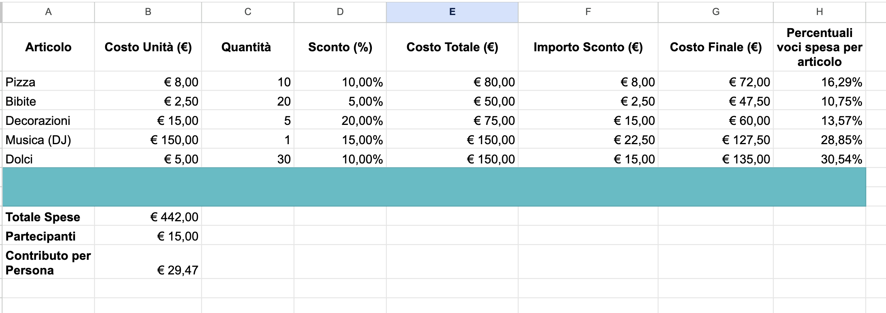

# 00-06 Esercitazione - Compito di realtà - Organizzazione di un Evento Speciale

Sei stato incaricato di organizzare una grande festa per la tua classe! Il budget è limitato, quindi dovrai gestire le spese con attenzione. Avrai bisogno di calcolare sconti, dividere le spese tra i partecipanti, e assicurarti che tutto sia in ordine. Questa esercitazione ti guiderà attraverso tutte le fasi necessarie, utilizzando le competenze che hai acquisito durante le esercitazioni precedenti.

---

## **Parte 1: Pianificazione del Budget**

**Obiettivo:** Calcolare il budget totale, applicare sconti su vari articoli, e determinare il costo finale.

1. **Inserimento Dati:**
   - Apri un nuovo foglio di calcolo.
   - Inserisci i seguenti titoli per le colonne:
     - **A1**: "Articolo"
     - **B1**: "Costo Unità (€)"
     - **C1**: "Quantità"
     - **D1**: "Sconto (%)"
     - **E1**: "Costo Totale (€)"
     - **F1**: "Importo Sconto (€)"
     - **G1**: "Costo Finale (€)"

   - Inserisci i seguenti dati nelle righe 2-6:
     - **A2**: "Pizza"
     - **A3**: "Bibite"
     - **A4**: "Decorazioni"
     - **A5**: "Musica (DJ)"
     - **A6**: "Dolci"

     - **B2**: 8,00
     - **B3**: 2,50
     - **B4**: 15,00
     - **B5**: 150,00
     - **B6**: 5,00

     - **C2**: 10
     - **C3**: 20
     - **C4**: 5
     - **C5**: 1
     - **C6**: 30

     - **D2**: 0,10 (inserisci il valore come numero decimale, non come percentuale)
     - **D3**: 0,05
     - **D4**: 0,20
     - **D5**: 0,15
     - **D6**: 0,10

2. **Calcola**

   - nella colonna E il costo totale, nella colonna F l'importo dello sconto, nella colonna G il costo finale dopo che si è applicato lo sconto.
   - ricordati che puoi scrivere le formule una sola volta e trascinarle usando il riferimento relativo
   - fomatta le celle della colonna D con il formato percetuale, due numeri dopo la virgola

---

## **Parte 2: Riepilogo e Gestione delle Spese**

**Obiettivo:** Calcolare il totale delle spese e determinare il contributo di ogni partecipante.

1. **Calcolo del Totale delle Spese:**
   - Seleziona la cella **A9**.
   - Digita "Totale Spese".
   - Nella cella **B9**, calcola il costo totale della festa (quindi dopo che si sono applicati gli sconti)

2. **Calcolo del Contributo per Partecipante:**
   - Immagina che alla festa partecipino 15 persone.
   - Seleziona la cella **A10**.
   - Digita "Partecipanti"
   - Seleziona la cella **A11**.
   - Digita "Contributo per Persona".
   - Nella cella **B11**, calcola quanto deve contribuire ciascuno
   - Formatta le celle  **B9, B10, B11** in modo che si visualizzi il formato euro e due cifre decimali

---

## **Parte 3: Percentuale di Costo Rispetto al Totale**

**Obiettivo:** Determinare la percentuale che ogni voce di spesa rappresenta rispetto al totale.

1. **Calcolo della Percentuale di Costo per Articolo:**
   - Seleziona la cella **H1** e digita "Percentuali voci spesa per articolo"
   - Seleziona la cella **H2** e digita la formula per calcolare la percentuale di costo di ciascun articolo rispetto al totale.
   - Trascina la formula da **H2** a **H6**.
   - Controlle come si sono adattate le formule da **H2** a **H6**. Hai usato riferimento assoluto e relativo correttamente?

2. **Formattazione Percentuale:**
   - Seleziona l'intervallo **H2:H6** e applica la formattazione percentuale per visualizzare le percentuali.

   **Spiegazione del Riferimento Assoluto:**
   - Il riferimento **$B$9** è assoluto, quindi quando trascini la formula verso il basso, il riferimento alla cella del totale rimane fisso.

---

## **Parte 4: Ulteriori Considerazioni**

**Obiettivo:** Riflettere su come i calcoli possono essere influenzati dalle scelte di input e formattazione.

1. **Verifica dei Calcoli:** 
   - Controlla che tutti i risultati siano coerenti.
   - Prova a cambiare il numero di partecipanti in **B10** e osserva come varia il contributo per persona.

2. **Formattazione del Foglio di Calcolo:**
   - Applica un bordo esterno e un colore di sfondo ai titoli delle colonne.
   - Centra i titoli e allinea i numeri nelle colonne **B-G** a destra.
   - Evidenzia le celle con i totali (B9, B10, B11) applicando il grassetto e un colore di sfondo differente.
   - Unisci le celle A7:H8
   - Formatta a piacere per rendere il tuo foglio di calcolo unico!

---

## **Parte 5: Riflettiamo Insieme**

- **Domande:** 
  - Cosa succede se cambi il numero di partecipanti? Come influisce sul contributo per persona?
  - Se decidi di non applicare alcuno sconto su un articolo, come cambia il risultato?
  - Come ha aiutato la formattazione del foglio di calcolo nella comprensione delle informazioni?

---

## **Conclusione:**
Questa esercitazione ti ha guidato attraverso l'intero processo di organizzazione di un evento, utilizzando le competenze che hai acquisito. Hai imparato a gestire un budget, calcolare sconti, suddividere le spese e formattare il foglio di calcolo per presentare i dati in modo chiaro e professionale. 

Ecco una traccia per verificare la tua soluzione:

