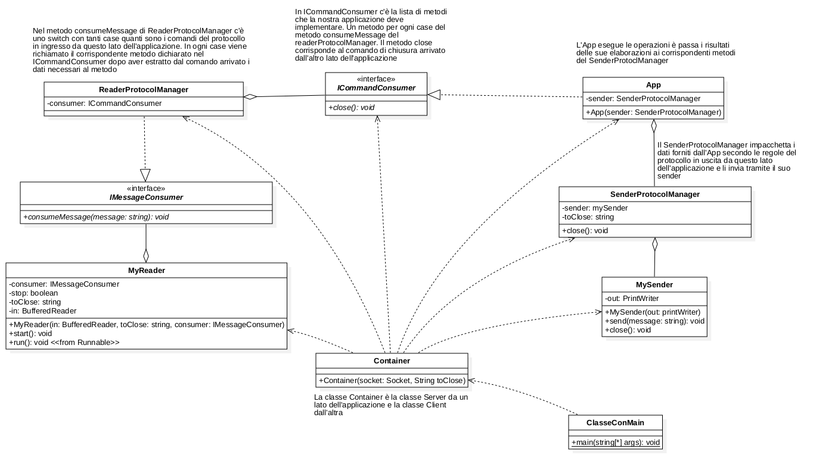

# Struttura classi

Testo dell'esercizio di laboratorio:
Un echo server che segue il seguente protocollo

Client -> Server

MESSAGE messaggio inviato
QUIT

Server->Client
SERVER RECEIVED messaggio ricevuto

**Implementazione del Server**
1. Creo ReaderProtocolManager che implementa IMessageConsumer con metodo consumeMessage.
   1. Nel metodo consumeMessage arriva il messaggio dal client con il comando del server