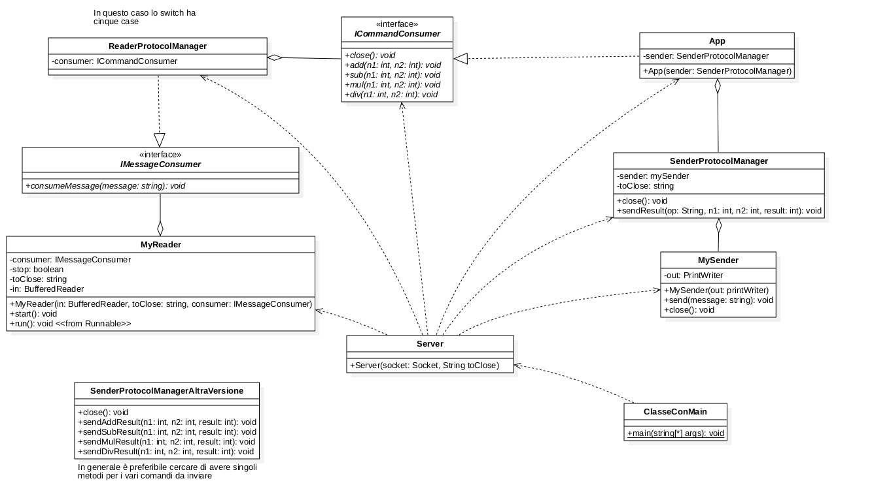
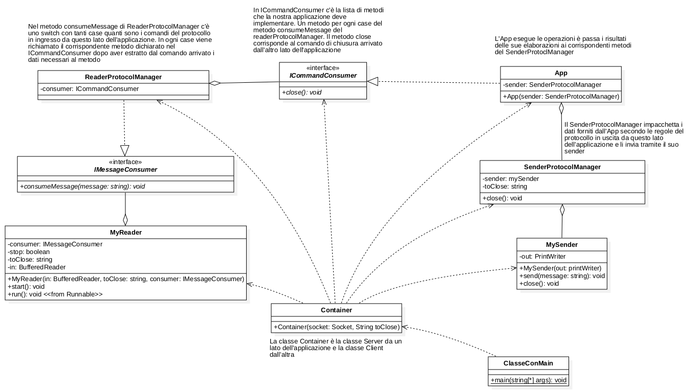

# Struttura classi

Testo dell'esercizio di laboratorio:
Un echo server che segue il seguente protocollo

Client -> Server

MESSAGE messaggio inviato
QUIT

Server->Client
SERVER RECEIVED messaggio ricevuto

**Implementazione del Server**
1. Creo ReaderProtocolManager che implementa IMessageConsumer con metodo consumeMessage.
   1. Nel metodo consumeMessage arriva il messaggio dal client con il comando del server
   2. ReaderProtocolManager ha una aggregazione con ICommandConsumer
      1. aggregazone ReaderProtocolManager ha un ICommandCOnsumer
   3. RPM contiene sempre uno switch case in base ai comandi che il client invia al server. Per echo solo QUIT e ECHO
2. Creo ICommandConsumer interfaccia che deve contentere i comandi messi a disposizione dal server. Ogni comando del server corrisponde ad un metodo da implementare in questa interfaccia.
   1. ICommandConsumer esibisce sempre un metodo close() con cui si chiude la comunicazione
   2. Per echo solo QUIT e ECHO
3. Creo SenderProtocolManager con i metodi necessari per inviare i comandi del client dal server
   1. echo message
   2. close stream
4. Creo App che implementa ICommandConsumer con i metodi per processare i messaggi del client. App costruisce la risposta e la manda al client tramite SenderProtocolManager
   1. qui solo echoMessage e close, all'interno richiamo metodi di SenderProtocolManager