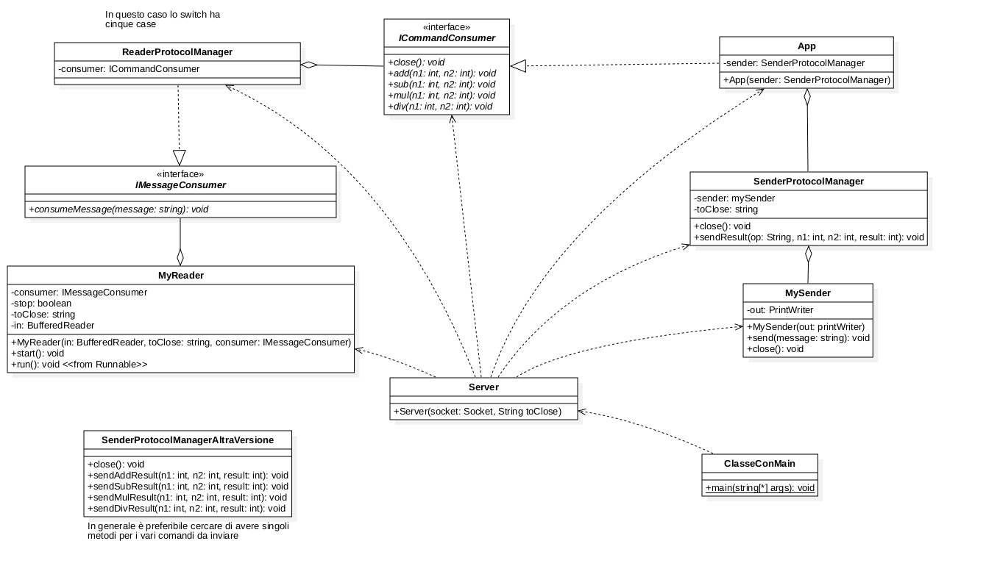

# Struttura classi

Testo dell'esercizio di laboratorio:
Scrivere il codice di un server per una chat utilizzando la struttura delle classi già vista in precedenti esempi. Per la scrittura del codice utilizzare le istruzioni presenti nel documento DalProtocolloAllAppicazione. Per la gestione della mappa vedere IstruzioniSparse

**Implementazione del Server**
Comandi del server
- USER_LIST al singolo utente connesso iniva lista utenti
  - formato USER_LIST#user#user
  - split su #
- MESSAGE invia messaggio a tutti quelli connessi
  - formato MESSAGE#SOURCE#MESSAGE
  - split su #
- PRIVATE_MESSAGE invia messsaggio privato
  - PRIVATE_MESSAGE#source#message
- USER_JOIN informa tutti gli altri di un nuovo utente
  - USER_JOIN#user
- USER_QUIT toglie utente e informa tutti gli altri
  - USER_QUITE#user
Comandi del client
- MESSAGE invio un messaggio a tutti
  - formato MESSAGE#messaggio
- PRIVATE_MESSAGE invia un messaggio privato
  - formato PRIVATE_MESSAGE#SOURCE#messaggio
- USER_QUIT

user_id dato da porta@indirizzoIp

1. Creo ReaderProtocolManager che implementa IMessageConsumer con metodo consumeMessage.
   1. Nel metodo consumeMessage arriva il messaggio dal client con il comando del server
   2. ReaderProtocolManager ha una aggregazione con ICommandConsumer
      1. aggregazone ReaderProtocolManager ha un ICommandCOnsumer
   3. RPM contiene sempre uno switch case in base ai comandi che il client invia al server. 
      - message a tutti
      - messge privato
      - quit
2. Creo ICommandConsumer interfaccia che deve contentere i comandi messi a disposizione dal server. Ogni comando del server corrisponde ad un metodo da implementare in questa interfaccia.
   1. ICommandConsumer esibisce sempre un metodo close() con cui si chiude la comunicazione
   2. message
   3. private_message
   4. USER_JOIN
   5. USERLIST
   USER_LIST e USER_Join sono due comandi che il server invia al client/ai client quando un nuovo client si connette alla chat 
3. Creo SenderProtocolManager con i metodi necessari per inviare i comandi del client dal server
   1. sendUserJoin, sendUserList, sendMessage, sendPrivateMessage
4. Creo App che implementa ICommandConsumer con i metodi per processare i messaggi del client. App costruisce la risposta e la manda al client tramite SenderProtocolManager
   1. nel costruttore invio i messagi user join e userlist
   2. app ha la mappa di spm vari
   3. qui gestiscono invio ad un solo client o a più client usando la mappa con i vari spm